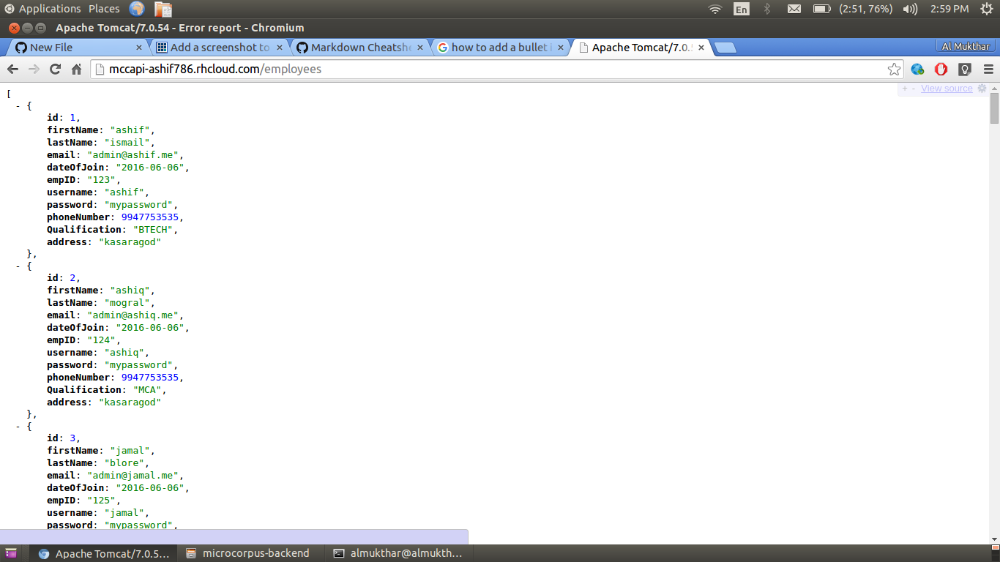
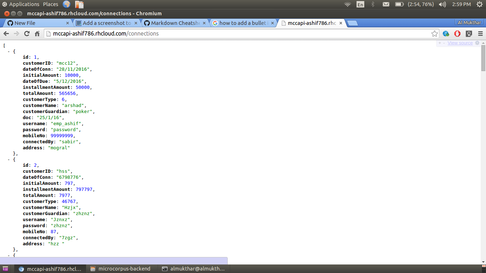

# MicroCorpus-Backend
The Production Level Backend for Microcorpus-Client powered by Spring MVC and Hibernate

RESTful API based on Spring MVC and hibernate,developed for managing all the daily routines for a clients requirements.
Uses MySQL as DB and Hibernate at Data Layer as ORM

### H3 Main features :
* CRUD on Employee Class
* CRUD on Collection Class(class that deals with various revenue objects)
* CRUD on customers Class 
* CRUD on Connection Class(class that deals with connections made by the workers)

### H3 Sample API Outputs in JSON :

* EMPLOYEE LIST 

* CUSTOMER LIST 

